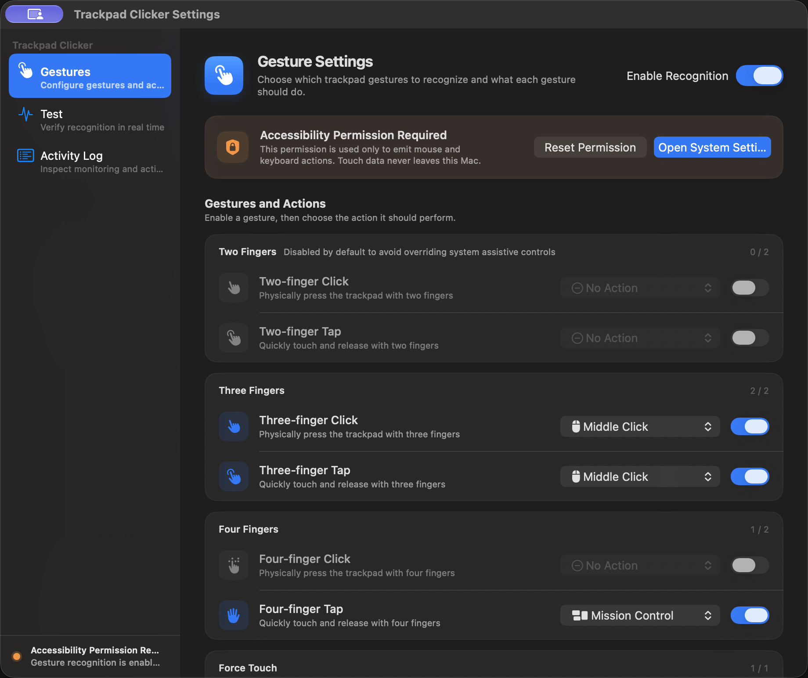
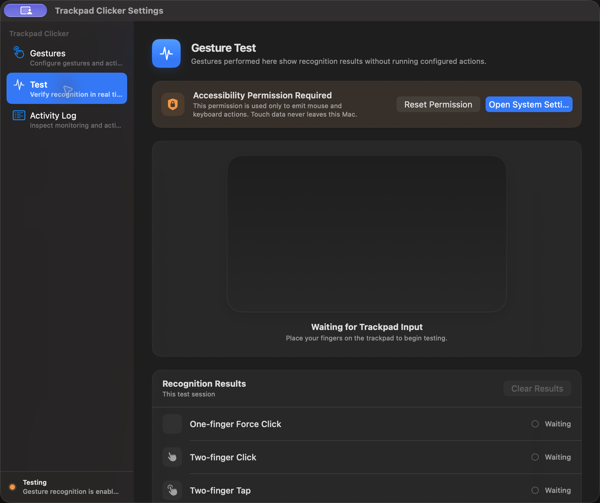
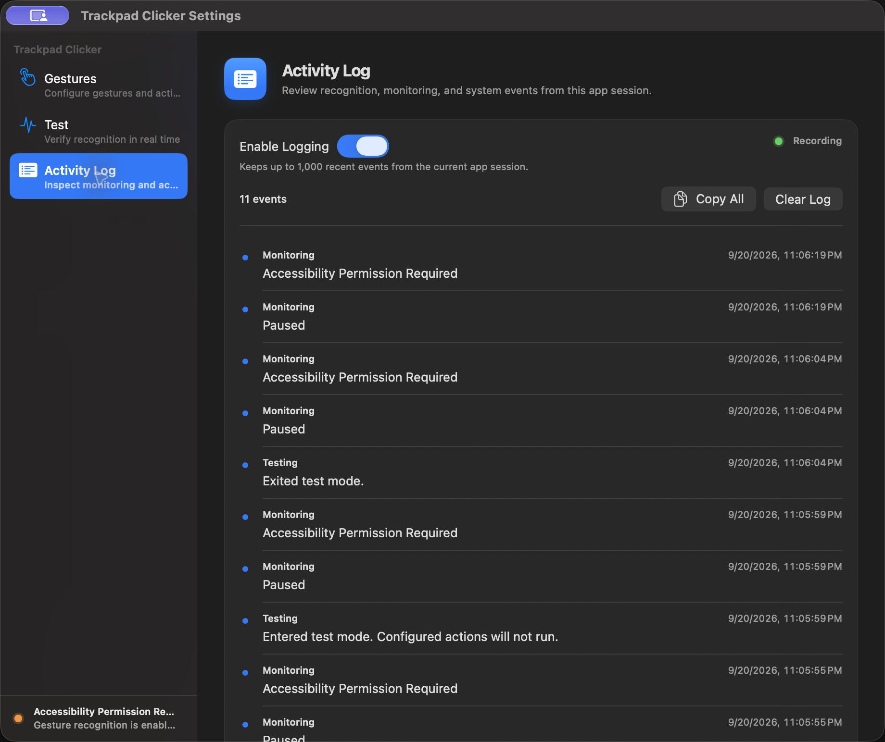
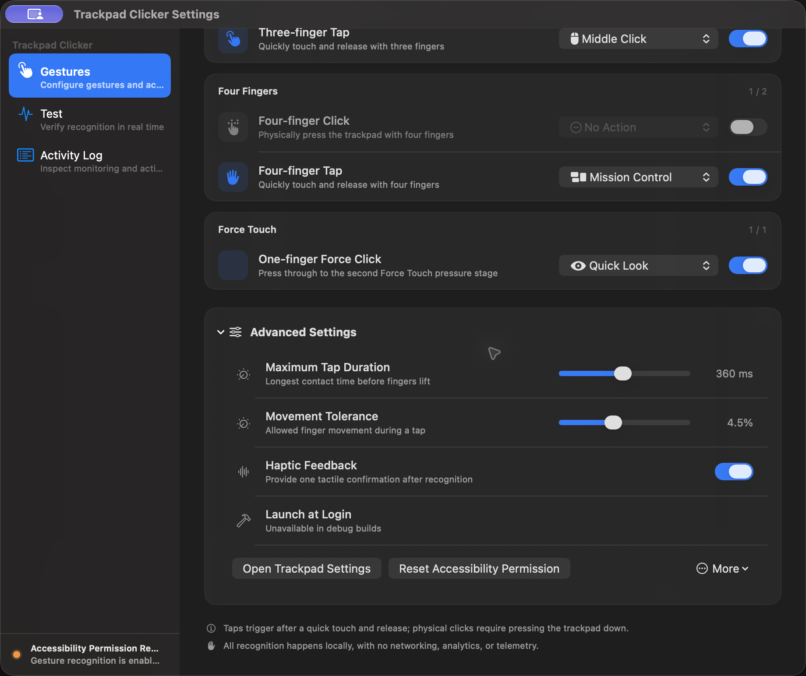

# Trackpad Clicker

Trackpad Clicker is a native macOS utility that turns multi-finger trackpad gestures into mouse clicks, system actions, and app shortcuts. It is written in Swift and SwiftUI, runs quietly in the background, and processes all touch data locally.



## Highlights

- Recognizes two-, three-, and four-finger taps and physical clicks.
- Recognizes a one-finger Force Click on Force Touch trackpads.
- Maps each gesture independently to a mouse click, macOS workspace command, Quick Look, or an application.
- Includes a live Gesture Test that never runs the configured actions.
- Provides adjustable tap duration, movement tolerance, and haptic feedback.
- Recovers monitoring after sleep, device disconnection, or an interrupted event monitor.
- Runs without a Dock, Command-Tab, or menu bar icon after the settings window is closed.
- Supports English and Traditional Chinese, following the macOS language preference.
- Contains no networking, analytics, advertising, or telemetry.

## Gesture Configuration

Every gesture has its own enable switch and action menu. The built-in defaults are deliberately conservative so common macOS assistive gestures are not replaced unexpectedly.

| Gesture | Default | Default action |
| --- | ---: | --- |
| One-finger Force Click | On | Quick Look |
| Two-finger Click | Off | No Action |
| Two-finger Tap | Off | No Action |
| Three-finger Click | On | Middle Click |
| Three-finger Tap | On | Middle Click |
| Four-finger Click | Off | No Action |
| Four-finger Tap | On | Mission Control |

Available actions:

- Left Click, Middle Click, and Right Click
- Quick Look
- Mission Control
- App Exposé
- Show Desktop
- Open or switch to a selected application
- No Action

When an application shortcut is selected, Trackpad Clicker launches the app if necessary or brings all of its windows forward when it is already running.

## Gesture Test

The Test page visualizes current finger contact and reports every supported gesture in real time. Test mode suppresses configured actions, so recognition can be checked safely before a binding is enabled.



Closing the settings window exits Test mode automatically.

## Activity Log

The optional in-app log records gesture recognition, requested actions, monitoring changes, reconnections, test-mode transitions, and sleep or wake events.



Logging is off by default. When enabled, the app keeps up to 1,000 recent events in memory for the current session. Disabling logging stops new entries without deleting the existing list. **Copy All** exports the visible session log, while **Clear Log** removes it. An action request confirms only that Trackpad Clicker issued the command; it does not confirm that another application completed it.

## Advanced Settings

Advanced Settings provides fine-grained recognition and maintenance controls:

- **Maximum Tap Duration** — the longest allowed contact before a touch stops qualifying as a tap.
- **Movement Tolerance** — the amount of finger movement permitted during a tap.
- **Haptic Feedback** — one tactile confirmation after a gesture is recognized.
- **Launch at Login** — starts the signed release app automatically after login.
- **Open Trackpad Settings** — opens the relevant macOS settings pane.
- **Reset Accessibility Permission** — clears a stale authorization entry and guides the user back to System Settings.
- **More** — reconnect monitoring, restore defaults, or quit the background app.



Sensitivity changes take effect immediately. The screenshots above were captured from the actual English debug build; the Accessibility notice is expected because the isolated documentation build was not granted system permission.

## Requirements

- macOS 14 Sonoma or later
- A built-in Mac trackpad or Apple Magic Trackpad
- A pressure-capable trackpad for multi-finger physical clicks
- A Force Touch trackpad for One-finger Force Click
- Accessibility permission to emit mouse and keyboard actions

## Build and Run

1. Open `TrackpadClicker.xcodeproj` in Xcode.
2. Select the **Trackpad Clicker (Direct)** scheme.
3. Build and run the app.
4. Choose **Open System Settings** in the app, then enable Trackpad Clicker under **Privacy & Security > Accessibility**.

The same debug build can be created from Terminal:

```zsh
xcodebuild \
  -project TrackpadClicker.xcodeproj \
  -scheme 'Trackpad Clicker (Direct)' \
  -sdk macosx \
  build
```

After the settings window is closed, gesture recognition continues in the background. Reopen the app from Finder or Spotlight to change its settings. To stop it completely, open **Advanced Settings > More > Quit App**.

Debug builds are isolated from the installed release app. They use the name `Trackpad Clicker Dev` and the bundle identifier `app.peterlee.trackpadclicker.debug`; Launch at Login is intentionally unavailable in debug builds. Release builds use `Trackpad Clicker` and `app.peterlee.trackpadclicker`.

## Localization

The String Catalog at `Resources/Localizable.xcstrings` contains complete English and Traditional Chinese interface text. English is the development language and is also used as the safe fallback for any missing localization. The app follows the language order configured in macOS.

When adding interface text, use a semantic localization key through `L10n` and supply an English fallback. Keep both `en` and `zh-Hant` entries complete before shipping.

## Reliability and Background Behavior

Touch processing is event-driven. While recognition is enabled, a lightweight health check runs every 15 seconds. Silent touch streams are conservatively reopened after 60 seconds, and transient device failures are retried after wake. Mouse and pressure monitors are installed only for enabled gestures. Non-trackpad multitouch devices, including the Touch Bar, are ignored; steady raw frames are limited to 60 Hz while finger landing and lift boundaries remain immediate.

## Tests

The Xcode project contains the native app target and a `TrackpadClickerTests` unit-test target. `Package.swift` is included for command-line development.

```zsh
swift test
```

## Technical Notes and Limitations

Public macOS APIs do not expose global raw multi-finger trackpad data. Trackpad Clicker dynamically loads Apple's private `MultitouchSupport.framework` at runtime and uses public Core Graphics APIs to emit mouse and keyboard events. Consequently:

- The app is intended for signed direct distribution, not the Mac App Store.
- A macOS update may change private framework behavior; test each target macOS release before distribution.
- Multi-finger physical clicks require pressure data so they can be distinguished reliably from tap-to-click events.
- If a three-finger tap also invokes the system Look Up gesture, disable **Look up & data detectors** in macOS Trackpad settings.

## Privacy

All touch recognition, preferences, and optional activity logs remain on the Mac. Trackpad Clicker has no networking code, analytics, telemetry, or cloud dependency.
